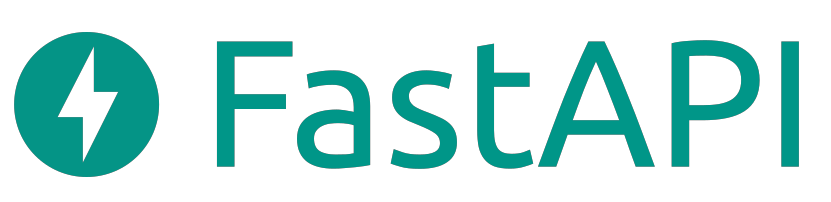
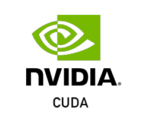

<!--
**franbvc/franbvc** is a ✨ _special_ ✨ repository because its `README.md` (this file) appears on your GitHub profile.

Here are some ideas to get you started:

- 🔭 I’m currently working on ...
- 🌱 I’m currently learning ...
- 👯 I’m looking to collaborate on ...
- 🤔 I’m looking for help with ...
- 💬 Ask me about ...
- 📫 How to reach me: ...
- 😄 Pronouns: ...
- ⚡ Fun fact: ...
-->

# Hello, I'm franbvc!

## About Me
- &#x1F1F3;&#x1F1F1; College student at [Maastricht University](https://www.maastrichtuniversity.nl/) studying Computer science.
- 🧠 Hungry for knowledge and always looking for new challenges. 
- 🤖 Passionate about machine learning, low-level programming, finance and cars. 
- 🌱 Plan on starting my own business in the future.
- 🌍 Fluent in:
    * &#x1F1EC;&#x1F1E7; English
    * &#x1F1E7;&#x1F1F7; Portuguese
    * &#x1F1E9;&#x1F1EA; German 
    * &#x1F1EA;&#x1F1F8; Spanish.

## Languages and Technologies

<!-- 
 -->

<table>
  <thead>
    <tr>
      <th>Categories</th>
      <th>Programming Languages</th>
      <th>Technologies</th>
    </tr>
  </thead>
  <tbody>
    <tr>
      <td>
        <text>Backend Development and APIs</text>
      </td>
      <td>
        
        
        
      </td>
      <td>
        
        
        
        
        
        
        
        
      </td> 
    </tr>
    <tr>
      <td>
        <text>Database</text>
      </td>
      <td>
        
      </td>
      <td>
        
        
        
        
      </td> 
    </tr>
    <tr>
      <td>
        <text>Machine Learning</text>
      </td>
      <td>
        
      </td>
      <td>
        
        
        
        
        
        
      </td> 
    </tr>
    <tr>
      <td>
        <text>Frontend Development</text>
      </td>
      <td>
        
        
        
        
        
      </td>
      <td>
        
        
      </td> 
    </tr>
    <tr>
      <td>
        <text>Cloud and DevOps</text>
      </td>
      <td>
        
      </td>
      <td>
        
        
        
      </td> 
    </tr>
    <tr>
      <td>
        <text>High Performance Computing</text>
      </td>
      <td>
        
      </td>
      <td>
        
        
        
      </td> 
    </tr>
    <tr>
      <td>
        <text>Compiler Development</text>
      </td>
      <td>
        
        
        
      </td>
      <td>
        <text>Flex</text>
        <text>Bison</text>
        <text>LLVM</text>
      </td> 
    </tr>
    <tr>
      <td>
        <text>Hardware Development</text>
      </td>
      <td>
        <text>VHDL</text>
      </td>
      <td>
        <text>FPGA</text>
        <text>Quartus</text>
        <text>GHDL</text>
      </td> 
    </tr>
    <tr>
      <td>
        <text>Others</text>
      </td>
      <td>
        
        
      </td>
      <td>
        
        
        
        
        
        
        
      </td> 
    </tr>
  </tbody>
</table>

## Projects
Here are some of the projects I've worked on:

### 1. [Silhouette Language](https://github.com/franbvc/silhouette-lang):
- A programming language made using C++, Flex, Bison and LLVM. It has the basic features of a programming language such as variables, functions, loops, conditionals, etc. Its syntax is similar to C, but with a few tweaks inspired by other languages such as Haskell and Rust. It is still a work in progress, but it is already possible to write and run programs in it. You can also check the generated LLVM IR code for each program.

### 2. [Crypto Channel](https://github.com/franbvc/CryptoChannel): 
- CLI tool, designed for security enthusiasts, using rust. It generates x25519 ECDH key pairs, derives keys using HKDF, and encrypts/decrypts messages with AES-GCM. This allows the user to exchange encrypted messages confidently through unsecure channels such as email or SMS.

### 3. [Sharpiler](https://github.com/franbvc/Sharpiler):
- A Julia compiler written from scratch in C#. It is able to do lexical analysis, syntactic analysis, semantic analysis, and NASM code generation. It can also act as an interpreter and run the code directly in C#.

Feel free to explore my repositories for more projects!

## Contact Me
- LinkedIn: https://www.linkedin.com/in/francisco-costa-6a119421b/
- GitHub: https://github.com/franbvc

Looking forward to connecting with you!